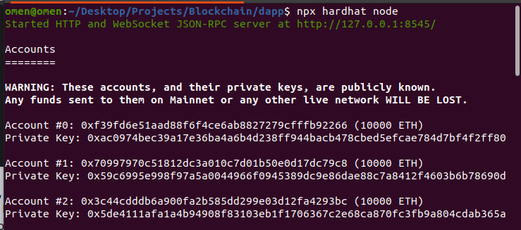
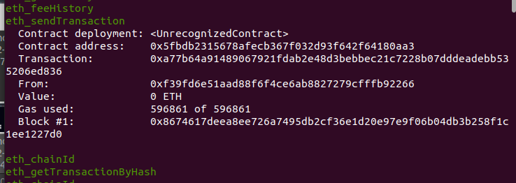
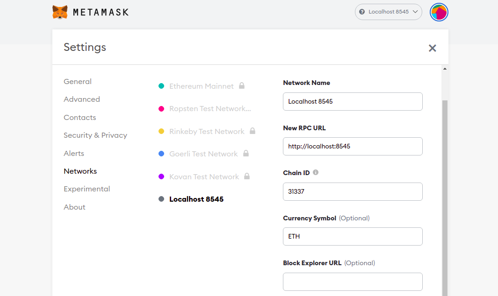
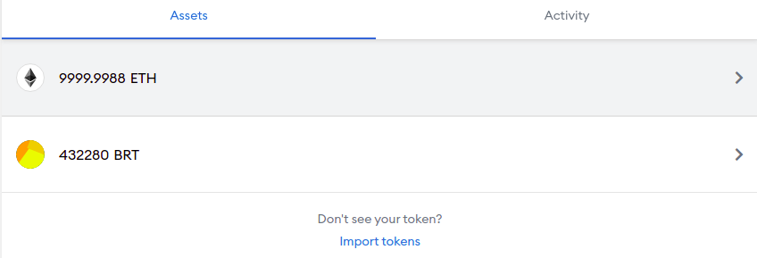

# First Decentralized React App

This project is built with React Js, Hardhat and Ether.js (similar to truffle and web3.js), which are great tools in building smart contracts.

## Prerequisites:

- You need Git installed on your computer. Use these guides to install it on [Linux](), [Mac OS]() and [Windows]()

- You need Node Js (Javascript Runtime environment for your computer) and its package manager (npm or yarn). Npm will used here but the commands are similar.

- ***MetaMask extension installed. Make sure to switch to the test networks. Enable Show test networks in Settings/Advanced.***

> Note: The rest of the requirements will be installed using npm

## Set Up:

- To start, clone this repository to your local machine using git.

```bash
# Run this is a directory you want the code to be there
git clone link
```

- Install all requirements and run hardhat development network
```bash
# Move into the project directory
cd decentapp
# install dependencies
npm install
# run hardhat node
npx hardhat node
```
<h6 id="account"></h6>
<p align="center">

</p>

> Note: You should see something similar to the above image. We will use the test accounts provided by hardhat to test the smart contract.

- Open another terminal amd deploy our smart contract to Hardhat local network using the following command
```bash
# Leave the other terminal with the network running
# Open a second terminal in the project directory
npx hardhat run --network localhost scripts/deploy.js
```
<h6 id="token"></h6>
<p align="center">

</p>

> Note: You should see the above in the first terminal running the node. The contract address will be used shortly

- Connect Metamask to the local network by going to Metamask Settings/Network. Edit your local network to be as shown or create a new network with the settings.

<p align="center">

</p>

> Note: Do not forget to set the Chain ID as shown 

- On metamask, make sure you have selected the testnet and click on import account. You will be asked for an account Private key which you can get [here](#account). Use any account.

- To see the Transactions of our smart contract token, click on import token once your test account has being added. This requires Token Contract Address which you can get [here](#token)

- Now you should be able to see your ETH balance and the BRT Token transactions as shown.

<p align="center">

</p>

- Finally, run the project and play around. During the first run Metamask will ask for permission to give access to the app.
```bash
# start project on localhost:3000
npm start
```

> This repository will be kept updated and feel free to create an issue if you have any issues
# :joy: Happy Coding
